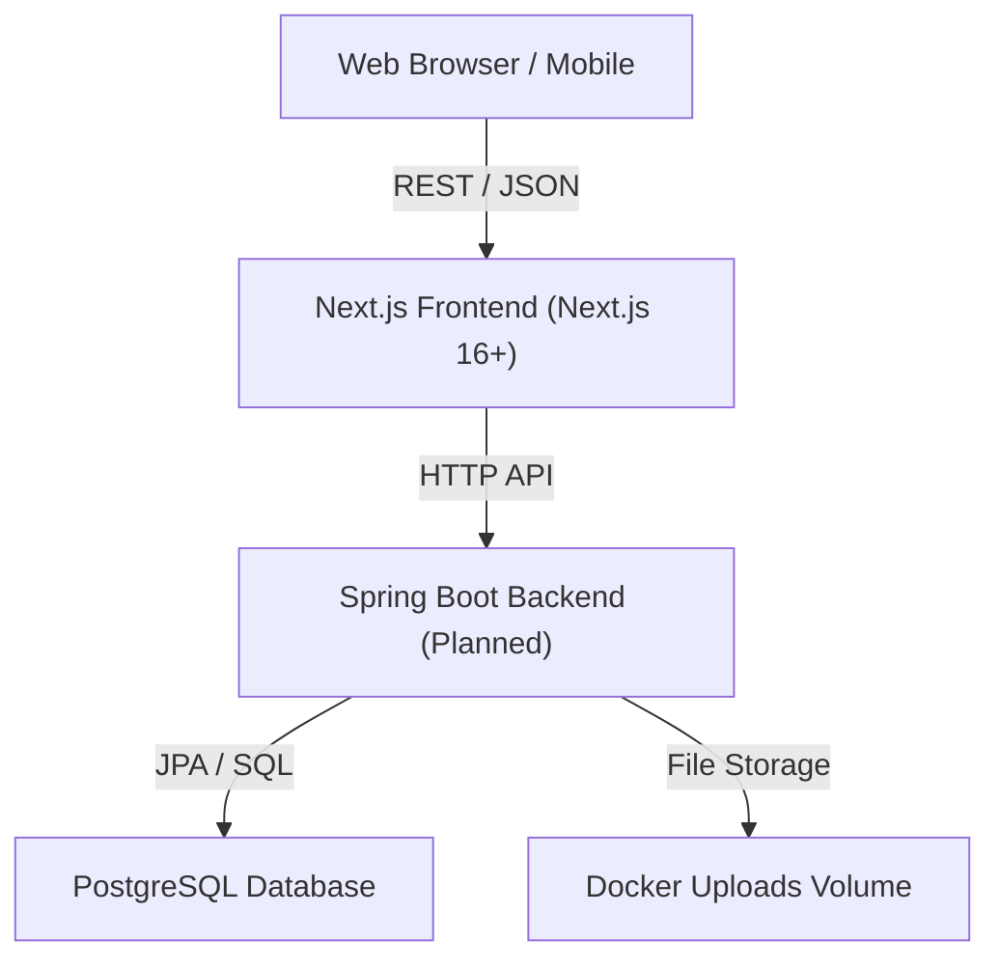

# Codebase Architecture: Nexus-OS

## High-Level Flow

## Architectural Patterns

- **Next.js App Router (Next.js 16+):** Leveraging Server Components for data fetching and Client Components for interactivity.
- **Component-Driven UI:** UI is decomposed into atomic, reusable components (via shadcn/ui patterns).
- **Module Separation:** Frontend logic is separated into `issues`, `docs`, and `certifications` modules for maintainability.
- **Stateless Auth (JWT - Planned):** Ensuring easy scalability and stateless sessions.
- **Relational Integrity:** Using PostgreSQL as the brain of the system, handling complex task/cert relationships.

## Data Flow

1. **Client Interaction:** User interacts with React components (shadcn/ui tiles/lists).
2. **State Management:** Local UI state handled by React `useState`/`useContext` or hooks.
3. **API Layer:** Calls to the backend REST API (Spring Boot).
4. **Persistence:** Backend logic interacts with PostgreSQL for reliable storage.
5. **Real-time/Scheduled:** Background jobs (e.g., expiry checks) run within the Spring Boot scheduler.
